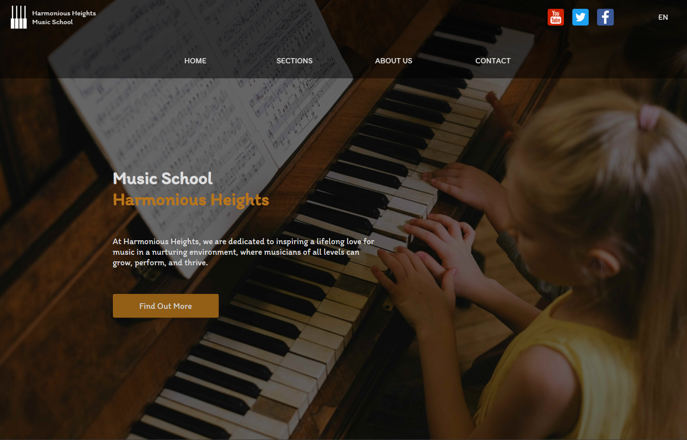
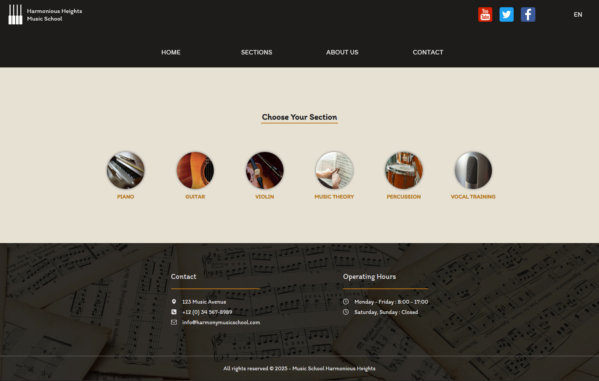
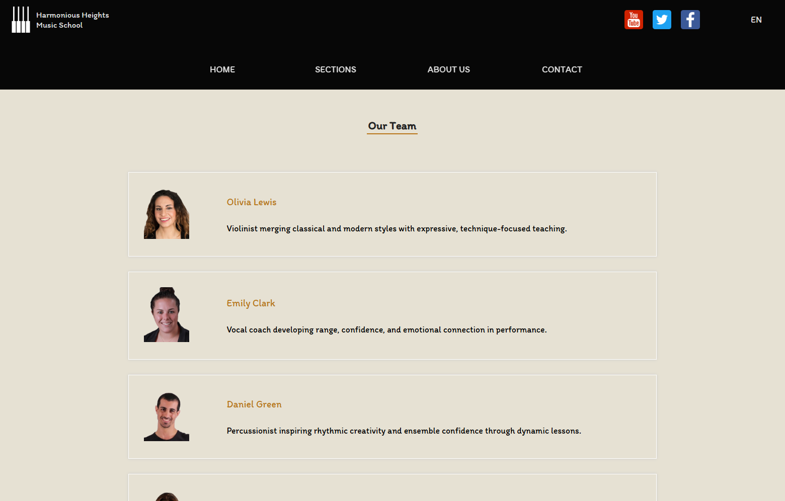
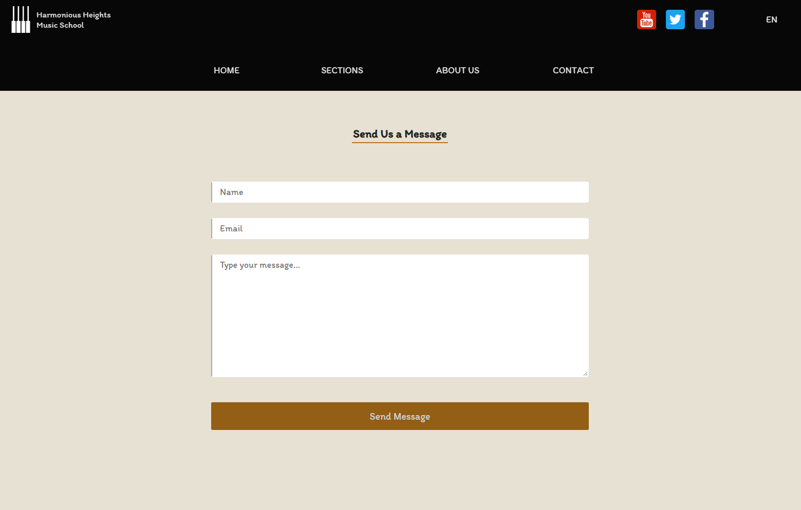

# Music School Website

A responsive React website for a fictional music school. The project presents the school, available music sections, instructors, contact details, location, and a working contact form.

The main focus of this project is building a polished multi-page landing website with responsive navigation, bilingual content, reusable components, and form handling without a custom backend.

## Live Demo

https://srdan-cakalj.github.io/music-school-website/

> If the repository name is different, update the live demo URL and the `base` value in `vite.config.js`.

## Screenshots

### Home page



### Music sections



### Our team



### Contact form



## Features

- Responsive layout for mobile, tablet, and desktop screens
- Mobile menu with open/close state
- Desktop navigation with dropdown submenus
- Multi-page routing with React Router
- Bilingual content support: English and German
- Centralized content data for easier text and language management
- Music section pages for piano, guitar, violin, music theory, percussion, and vocal training
- Instructor/team section with expandable details
- Contact details section with phone, email, and map links
- Contact form powered by EmailJS
- Form validation with custom feedback messages
- Google Maps location embed
- Scroll-to-top behavior when changing pages
- Reusable wrapper, layout, header, footer, navigation, and card-style components

## Tech Stack

- React
- JavaScript
- React Router
- React Responsive
- EmailJS
- CSS Modules
- Vite
- GitHub Pages

## Project Structure

```txt
src/
├── components/        # Reusable UI sections and page blocks
├── data/              # Centralized bilingual content
├── layouts/           # Main layout with header, footer, menu and outlet
├── router/            # React Router configuration
├── App.jsx
├── main.jsx
└── index.css          # Global styles and CSS variables
```

## Environment Variables

The contact form uses EmailJS. Create a `.env` file in the project root and add your own EmailJS values:

```env
VITE_EMAILJS_PUBLIC_KEY=your_public_key
VITE_EMAILJS_SERVICE_ID=your_service_id
VITE_EMAILJS_TEMPLATE_ID=your_template_id
```

The `.env` file should not be committed to GitHub.

## Getting Started

Clone the repository:

```bash
git clone https://github.com/srdan-cakalj/music-school-website.git
cd music-school-website
```

Install dependencies:

```bash
npm install
```

Start the development server:

```bash
npm run dev
```

Build the project:

```bash
npm run build
```

Preview the production build locally:

```bash
npm run preview
```

## Deployment

This project is configured for deployment to GitHub Pages.

If the repository is named `music-school-website`, the Vite config should use:

```js
base: '/music-school-website/'
```

Then deploy with:

```bash
npm run deploy
```

## What I Practiced

- Creating a responsive React website from reusable components
- Structuring a multi-page app with React Router
- Managing bilingual UI content from a central data file
- Building mobile and desktop navigation patterns
- Handling form state and validation in React
- Integrating EmailJS for frontend-only message sending
- Organizing styles with CSS Modules and global CSS variables
